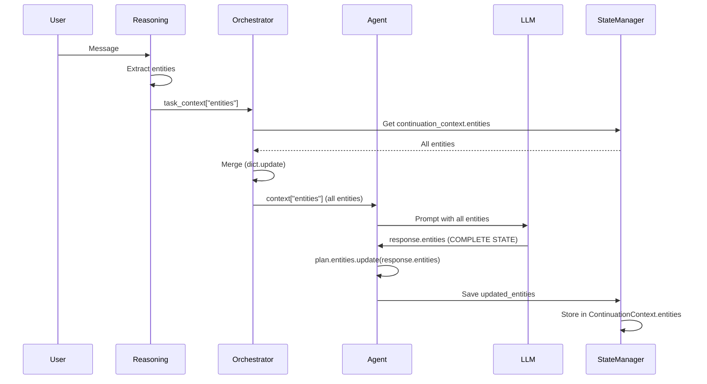
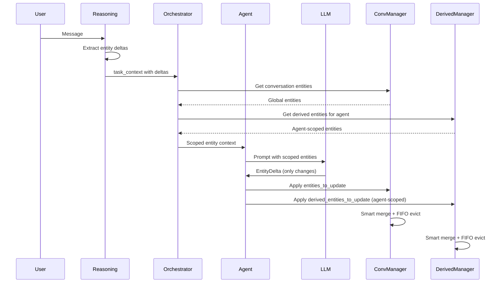
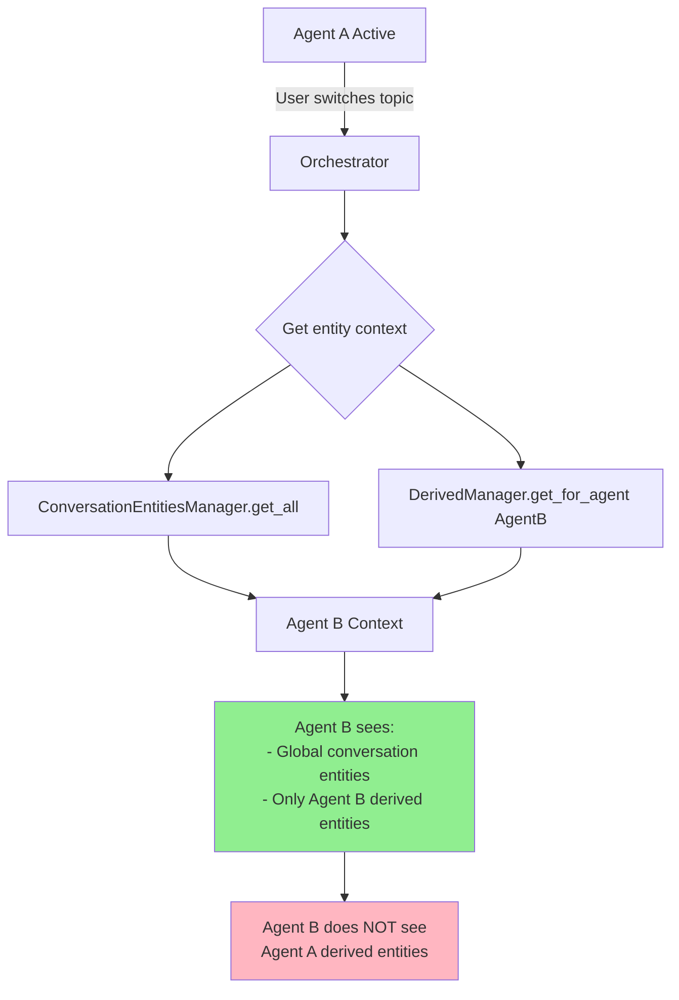

# Entity Architecture Migration Plan

## Executive Summary

This document outlines a comprehensive migration plan to refactor the entity management system from a monolithic "complete state regeneration" model to a delta-based, scoped architecture with clear separation between conversation entities and derived entities.

**Current Problem:** LLM generates complete entities object every turn, mixing conversation data with tool results, with no agent scoping or efficient merging.

**Target Architecture:** Delta-based updates, agent-scoped derived entities, FIFO eviction, smart merging.

---

## Phase 1: Investigation & Mapping

### 1.1 File Inventory

#### Core Entity Management Files

**State Management:**
- `src/patient_ai_service/core/state_manager.py` (1299 lines)
  - `ContinuationContext.entities` - Dict[str, Any] storing entities between turns
  - `set_continuation_context()` - Stores entities when agent blocks
  - `get_continuation_context()` - Retrieves entities when resuming
  - Lines 84, 667, 713: entities field in ContinuationContext
  - Lines 736-745: get_continuation_context() returns entities

**Entity Models:**
- `src/patient_ai_service/models/entity_state.py` (400 lines)
  - `EntityState` - Contains PatientEntities + DerivedEntitiesManager
  - `store_tool_result()` - Extracts derived entities from tool results
  - **STATUS:** Derived entities stored but NOT queried in continuation flow (see line 10-25)
  
- `src/patient_ai_service/models/derived_entities.py` (451 lines)
  - `DerivedEntity` - Single derived entity with validity tracking
  - `DerivedEntitiesManager` - Manages all derived entities for session
  - **STATUS:** Dead code - stored but never queried (see line 11-32)

- `src/patient_ai_service/models/patient_entities.py` (215 lines) ✅ **NOW READ**
  - `PatientEntities` - Source of truth for patient preferences
  - `AppointmentPreferences` - Doctor, date, time, procedure preferences
  - `PersonalInfo` - Registration information
  - `EntitySource` enum - Tracks how entity was obtained (USER_STATED, EXTRACTED, INFERRED)
  - `update_preference()` - Updates with change tracking
  - **KEY FINDING:** This is a structured model, NOT a dict. Current entities dict doesn't use this structure.
  - **IMPLICATION:** Migration needs to map between dict entities and PatientEntities structure

- `src/patient_ai_service/models/state.py` (328 lines)
  - `GlobalState` - Explicitly notes entities NOT stored here (lines 152-174)
  - Documents that entities flow through ContinuationContext and AgentPlan

**Agent Plan:**
- `src/patient_ai_service/models/agent_plan.py` (313 lines)
  - `AgentPlan.entities` - Dict[str, Any] accumulating during plan execution (line 115)
  - `unblock_with_info()` - Updates plan.entities (line 252)
  - `mark_task_complete()` - Updates plan.entities from tool results (line 206)

**Agent Implementation:**
- `src/patient_ai_service/agents/base_agent.py` (5787 lines)
  - `_parse_thinking_response()` - Extracts entities from LLM response (lines 3744-3973)
  - `thinking.updated_entities` - Merged entities after each turn (line 300, 3933-3963)
  - `_extract_entities()` - Legacy entity extraction (line 4005)
  - `_store_derived_entities()` - Stores tool results (line 2347)
  - Lines 1622-1666: Uses updated_entities as canonical view
  - Lines 1218-1221: Updates plan with new entities
  - Lines 3933-3947: Merges response.entities into updated_resolved

**Orchestrator:**
- `src/patient_ai_service/core/orchestrator.py` (1729 lines)
  - `_extract_task_context()` - Merges entities from reasoning + continuation (lines 1342-1415)
  - `_build_agent_context()` - Builds context with entities (lines 1500-1579)
  - Lines 1391-1400: Merges continuation_context.entities into task_context
  - Lines 1548: Passes entities to agent context

**Reasoning Engine:**
- `src/patient_ai_service/core/reasoning.py` (2250 lines) ✅ **NOW READ**
  - `ReasoningEngine.reason()` - Main reasoning entry point
  - `_parse_reasoning_response()` - Extracts entities from reasoning output (lines 852-1045)
  - `TaskContext.entities` - Entities extracted from user message (line 68)
  - Lines 939-947: Merges continuation entities into task_context
  - Lines 1004-1009: Logs entities extracted by reasoning engine
  - **KEY FINDING:** Reasoning engine extracts entities into `task_context.entities` dict
  - **IMPLICATION:** Need to convert reasoning entities to delta format

**Prompt Templates:**
- `src/patient_ai_service/core/prompt_cache.py` (302 lines)
  - `UNIVERSAL_OUTPUT_FORMAT` - Instructs LLM to output complete entities (lines 189-200)
  - Line 195: "Always fill entities with EVERYTHING you know so far"
  - Line 254: "Fill entities with EVERYTHING you know so far"

#### Files That Read Entities

1. **base_agent.py:**
   - Line 861: Receives entities in process_message()
   - Line 1206: Passes entities to plan creation
   - Line 1219: Updates plan with new entities
   - Line 1230, 1239: Passes entities to thinking
   - Line 1622-1666: Extracts resolved entities
   - Line 2395-2428: Builds resolution context from entities
   - Line 3243-3245: Documents entity sources
   - Line 3282-3283: Formats entities for prompt
   - Line 3456-3472: Gets entities from plan and context
   - Line 3561-3565: Formats entities for prompt
   - Line 3933-3963: Merges entities into updated_resolved
   - Line 4005-4020: Extracts entities from exec_context
   - Line 4251-4253: Logs entities
   - Line 5100-5101: Formats entities
   - Line 5625-5637: Formats entities for display

2. **orchestrator.py:**
   - Lines 1391-1400: Merges continuation entities
   - Line 1548: Passes entities to agent context

3. **reasoning.py:**
   - Lines 939-947: Merges continuation entities

4. **state_manager.py:**
   - Lines 84, 667, 713: ContinuationContext.entities
   - Lines 736-745: Returns entities from continuation

5. **agent_plan.py:**
   - Line 115: Plan.entities field
   - Line 206: Updates entities from tool results
   - Line 252: Updates entities when unblocking

### 1.2 Current Data Flow

```
┌─────────────────────────────────────────────────────────────────┐
│                    CURRENT ENTITY FLOW                         │
└─────────────────────────────────────────────────────────────────┘

Turn N:
1. User sends message
2. Reasoning Engine extracts entities → task_context["entities"]
3. Orchestrator merges continuation_context.entities → task_context["entities"]
4. Agent receives task_context["entities"]
5. Agent LLM outputs response.entities (COMPLETE STATE - all entities)
6. Agent merges: plan.entities.update(response.entities)
7. Agent stores: updated_entities → ContinuationContext.entities
8. If agent blocks: ContinuationContext saved to state_manager

Turn N+1:
1. User sends message
2. Reasoning Engine extracts entities → task_context["entities"]
3. Orchestrator merges continuation_context.entities → task_context["entities"]
4. Agent receives task_context["entities"] (merged from continuation + reasoning)
5. Agent LLM outputs response.entities (COMPLETE STATE again)
6. Repeat...
```

**Key Issues:**
- LLM outputs COMPLETE state every turn (wasteful)
- No distinction between conversation entities vs derived entities
- Simple dict.update() - no deduplication, no FIFO
- Derived entities exist but NOT queried (dead code)
- No agent scoping - all agents see all entities

### 1.3 LLM Prompt Structure

**Current Prompt (prompt_cache.py, lines 189-200):**
```json
"response": {
    // Always fill entities with EVERYTHING you know so far and need:
    "entities": {
        "patient_id": "...",
        "doctor_name": "...",
        "date": "...",
        "time": "..."
    }
}
```

**Current Instruction (line 254):**
```
- Fill entities with EVERYTHING you know so far
```

**LLM Output Format:**
- Complete dict with all entities
- No delta indication
- No separation of conversation vs derived

### 1.4 Current Entity Structure

**ContinuationContext.entities:**
- Type: `Dict[str, Any]`
- Contains: Mixed conversation + derived entities
- Examples: `{"doctor_preference": "Dr. Smith", "available_slots": [...]}`
- No ordering, no timestamps, no scoping

**AgentPlan.entities:**
- Type: `Dict[str, Any]`
- Contains: Accumulated entities during plan execution
- Updated via: `plan.entities.update(new_entities)`
- No deduplication, no FIFO

**DerivedEntitiesManager (NOT USED):**
- Type: `Dict[str, DerivedEntity]`
- Contains: Tool results with validity tracking
- Stored but NEVER queried in continuation flow
- Has validity rules, TTL, invalidation logic (unused)

### 1.5 Agent Switching Behavior

**Current Behavior:**
- When switching Agent A → Agent B:
  - Agent B receives `task_context["entities"]` which includes ALL entities
  - No filtering by agent
  - No scoping of derived entities
  - ContinuationContext.entities persists across agents

**Files Involved:**
- `orchestrator.py` - `_build_agent_context()` - passes all entities
- `state_manager.py` - `get_continuation_context()` - returns all entities
- `base_agent.py` - Receives all entities, no filtering

### 1.6 Agent Name Propagation Trace ✅ **NEW**

**Agent Name Flow:**

1. **Initialization (orchestrator.py:123-144):**
   ```python
   self.agents = {
       "appointment_manager": AppointmentManagerAgent(...),
       "registration": RegistrationAgent(...),
       ...
   }
   ```
   - Agent names are string keys: "appointment_manager", "registration", etc.

2. **Agent Constructor (base_agent.py:684-691):**
   ```python
   def __init__(self, agent_name: str, ...):
       self.agent_name = agent_name  # Stored as instance variable
   ```
   - `agent_name` is passed to constructor
   - Stored as `self.agent_name` (always available in agent instance)

3. **Tool Storage Calls (base_agent.py:2347-2372):**
   ```python
   def _store_derived_entities(self, session_id, tool_name, tool_input, result):
       stored = self.state_manager.store_tool_result(
           session_id, tool_name, tool_input, result
       )
   ```
   - **GAP IDENTIFIED:** `store_tool_result()` doesn't take `agent_name` parameter!
   - Current: `state_manager.store_tool_result(session_id, tool_name, tool_params, tool_result)`
   - Needed: `state_manager.store_tool_result(session_id, agent_name, tool_name, tool_params, tool_result)`
   - **FIX REQUIRED:** Update `store_tool_result()` signature to accept `agent_name`

4. **Agent Name Availability:**
   - ✅ Available in `BaseAgent` as `self.agent_name`
   - ✅ Available when calling `_store_derived_entities()` (line 4639, 4720)
   - ❌ NOT passed to `store_tool_result()` currently
   - ❌ NOT in `ExecutionContext` (would need to add if needed)

**Required Changes:**
- Update `state_manager.store_tool_result()` to accept `agent_name` parameter
- Update `base_agent._store_derived_entities()` to pass `self.agent_name`
- Update `entity_state.store_tool_result()` to accept `agent_name`
- Add validation: Raise error if `agent_name` is None or invalid

**Validation Points:**
- Add check in `_store_derived_entities()`: `assert self.agent_name, "agent_name must be set"`
- Add check in `store_tool_result()`: `if not agent_name: raise ValueError("agent_name required")`
- Log agent_name on every storage operation for debugging

### 1.7 Risk Assessment

**High Risk Areas:**
1. **Entity Merging Logic** (base_agent.py:3933-3963)
   - Current: Simple dict.update()
   - Risk: Breaking merge logic could lose entities
   - Impact: HIGH - affects all agent operations

2. **Continuation Flow** (state_manager.py, orchestrator.py)
   - Current: Entities persist in ContinuationContext
   - Risk: Changing structure could break resumption
   - Impact: HIGH - breaks conversation continuity

3. **LLM Prompt Changes** (prompt_cache.py)
   - Current: Instructs complete state output
   - Risk: LLM might not adapt to delta format
   - Impact: MEDIUM - can fallback to old format

4. **Agent Plan Updates** (agent_plan.py, base_agent.py)
   - Current: plan.entities.update() throughout
   - Risk: Changing update logic could break plan state
   - Impact: HIGH - affects plan execution

5. **Reasoning Engine** (reasoning.py)
   - Current: Extracts entities from reasoning output
   - Risk: Changing format could break extraction
   - Impact: MEDIUM - reasoning can adapt

**Low Risk Areas:**
1. **DerivedEntitiesManager** (derived_entities.py)
   - Current: Dead code, not queried
   - Risk: Low - already unused
   - Impact: LOW - can be safely refactored

2. **EntityState** (entity_state.py)
   - Current: Used for tool result storage only
   - Risk: Low - isolated usage
   - Impact: LOW - can be enhanced incrementally

---

## Phase 2: Design New Architecture

### 2.1 Data Structure Definitions

#### ConversationEntity

```python
from datetime import datetime
from typing import Any
from pydantic import BaseModel, Field

class ConversationEntity(BaseModel):
    """A single conversation entity (user intent/preferences)."""
    key: str                           # "doctor_preference", "time_preference"
    value: Any                         # The actual value
    inserted_at: datetime = Field(default_factory=datetime.utcnow)  # For FIFO ordering
    source: str = "conversation"       # Always "conversation"
    
    def age_seconds(self) -> float:
        """Get age in seconds for FIFO eviction."""
        return (datetime.utcnow() - self.inserted_at).total_seconds()
```

#### DerivedEntity (Enhanced)

```python
class DerivedEntity(BaseModel):
    """A single derived entity (tool/process result)."""
    key: str                           # "available_slots", "doctor_uuid"
    value: Any                         # The actual value
    agent_name: str                    # Which agent created this (NEW)
    inserted_at: datetime = Field(default_factory=datetime.utcnow)  # For FIFO ordering
    source_tool: str                   # Tool that generated this
    source_params: Dict[str, Any] = Field(default_factory=dict)
    valid_for: Optional[int] = None   # TTL in seconds
    
    def age_seconds(self) -> float:
        """Get age in seconds for FIFO eviction."""
        return (datetime.utcnow() - self.inserted_at).total_seconds()
```

#### ConversationEntitiesManager

```python
class ConversationEntitiesManager(BaseModel):
    """Manages conversation entities (global, follows conversation)."""
    session_id: str
    entities: Dict[str, ConversationEntity] = Field(default_factory=dict)
    max_size: int = 7  # Max entities before FIFO eviction
    created_at: datetime = Field(default_factory=datetime.utcnow)
    last_updated_at: datetime = Field(default_factory=datetime.utcnow)
    
    def apply_delta(
        self,
        delta: Dict[str, Any]
    ) -> Dict[str, Any]:
        """
        Apply delta updates with smart merging.
        
        Returns:
            Dict with:
            - updated: List of keys that were overwritten
            - added: List of keys that were new
            - evicted: List of keys that were evicted (if exceeded max_size)
        """
        result = {"updated": [], "added": [], "evicted": []}
        
        # Apply updates (overwrite existing, append new)
        for key, value in delta.items():
            if key in self.entities:
                # Overwrite existing
                self.entities[key].value = value
                # Keep original inserted_at for FIFO ordering
                result["updated"].append(key)
            else:
                # Append new
                self.entities[key] = ConversationEntity(
                    key=key,
                    value=value,
                    inserted_at=datetime.utcnow()
                )
                result["added"].append(key)
        
        # FIFO eviction if exceeded max_size
        if len(self.entities) > self.max_size:
            # Sort by insertion time, oldest first
            sorted_entities = sorted(
                self.entities.items(),
                key=lambda x: x[1].inserted_at
            )
            
            # Evict oldest entities
            evict_count = len(self.entities) - self.max_size
            for i in range(evict_count):
                key, _ = sorted_entities[i]
                del self.entities[key]
                result["evicted"].append(key)
        
        self.last_updated_at = datetime.utcnow()
        return result
    
    def get_all(self) -> Dict[str, Any]:
        """Get all entity values as simple dict."""
        return {k: v.value for k, v in self.entities.items()}
    
    def get_ordered(self) -> List[Tuple[str, Any]]:
        """Get entities ordered by insertion time (oldest first)."""
        sorted_items = sorted(
            self.entities.items(),
            key=lambda x: x[1].inserted_at
        )
        return [(k, v.value) for k, v in sorted_items]
```

#### AgentScopedDerivedEntitiesManager

```python
class AgentScopedDerivedEntitiesManager(BaseModel):
    """Manages derived entities scoped by agent."""
    session_id: str
    # Structure: {agent_name: {key: DerivedEntity}}
    agent_entities: Dict[str, Dict[str, DerivedEntity]] = Field(default_factory=dict)
    max_size_per_agent: int = 7
    created_at: datetime = Field(default_factory=datetime.utcnow)
    last_updated_at: datetime = Field(default_factory=datetime.utcnow)
    
    def apply_delta(
        self,
        agent_name: str,
        delta: Dict[str, Any],
        source_tool: str,
        source_params: Dict[str, Any] = None
    ) -> Dict[str, Any]:
        """
        Apply delta updates for a specific agent.
        
        Only affects the specified agent's namespace.
        Other agents' derived entities are untouched.
        
        Returns:
            Dict with updated/added/evicted keys
        """
        if agent_name not in self.agent_entities:
            self.agent_entities[agent_name] = {}
        
        agent_dict = self.agent_entities[agent_name]
        result = {"updated": [], "added": [], "evicted": []}
        
        # Apply updates
        for key, value in delta.items():
            if key in agent_dict:
                agent_dict[key].value = value
                result["updated"].append(key)
            else:
                agent_dict[key] = DerivedEntity(
                    key=key,
                    value=value,
                    agent_name=agent_name,
                    source_tool=source_tool,
                    source_params=source_params or {},
                    inserted_at=datetime.utcnow()
                )
                result["added"].append(key)
        
        # FIFO eviction
        if len(agent_dict) > self.max_size_per_agent:
            sorted_items = sorted(
                agent_dict.items(),
                key=lambda x: x[1].inserted_at
            )
            evict_count = len(agent_dict) - self.max_size_per_agent
            for i in range(evict_count):
                key, _ = sorted_items[i]
                del agent_dict[key]
                result["evicted"].append(key)
        
        self.last_updated_at = datetime.utcnow()
        return result
    
    def get_for_agent(self, agent_name: str) -> Dict[str, Any]:
        """Get derived entities for a specific agent only."""
        if agent_name not in self.agent_entities:
            return {}
        return {k: v.value for k, v in self.agent_entities[agent_name].items()}
    
    def clear_agent(self, agent_name: str):
        """Clear all derived entities for an agent."""
        if agent_name in self.agent_entities:
            del self.agent_entities[agent_name]
            self.last_updated_at = datetime.utcnow()
```

#### EntityDelta (LLM Output Format)

```python
class EntityDelta(BaseModel):
    """Delta update from LLM."""
    entities_to_update: Dict[str, Any] = Field(default_factory=dict)
    derived_entities_to_update: Dict[str, Any] = Field(default_factory=dict)
    
    def is_empty(self) -> bool:
        """Check if delta has any updates."""
        return not self.entities_to_update and not self.derived_entities_to_update
```

### 2.2 Merging Algorithm Pseudocode

```python
def merge_entity_delta(
    conversation_manager: ConversationEntitiesManager,
    derived_manager: AgentScopedDerivedEntitiesManager,
    agent_name: str,
    delta: EntityDelta
) -> Dict[str, Any]:
    """
    Merge delta updates into entity stores.
    
    Returns:
        Summary of what was merged
    """
    result = {
        "conversation": {"updated": [], "added": [], "evicted": []},
        "derived": {"updated": [], "added": [], "evicted": []}
    }
    
    # Merge conversation entities (global)
    if delta.entities_to_update:
        conv_result = conversation_manager.apply_delta(delta.entities_to_update)
        result["conversation"] = conv_result
    
    # Merge derived entities (agent-scoped)
    if delta.derived_entities_to_update:
        # Need source_tool - this comes from the tool call that generated the delta
        # For LLM-generated deltas, we'll use "llm_reasoning" as source
        derived_result = derived_manager.apply_delta(
            agent_name=agent_name,
            delta=delta.derived_entities_to_update,
            source_tool="llm_reasoning",
            source_params={}
        )
        result["derived"] = derived_result
    
    return result
```

### 2.3 Agent Scoping Logic

```python
def get_agent_entity_context(
    session_id: str,
    agent_name: str,
    conversation_manager: ConversationEntitiesManager,
    derived_manager: AgentScopedDerivedEntitiesManager
) -> Dict[str, Any]:
    """
    Get entity context for a specific agent.
    
    Returns:
        {
            "entities": {...},  # Global conversation entities
            "derived_entities": {...}  # Only this agent's derived entities
        }
    """
    return {
        "entities": conversation_manager.get_all(),
        "derived_entities": derived_manager.get_for_agent(agent_name)
    }
```

**Agent Switching Behavior:**
- Agent A → Agent B:
  - Agent B sees: `conversation_manager.get_all()` (global)
  - Agent B sees: `derived_manager.get_for_agent("agent_b")` (only its own)
  - Agent B does NOT see: `derived_manager.get_for_agent("agent_a")` (isolated)

### 2.4 Integration Points

**1. After LLM Response Parsing:**
- Location: `base_agent.py:_parse_thinking_response()`
- Current: Extracts `response.entities` (complete state)
- New: Extract `response.entities_to_update` and `response.derived_entities_to_update` (deltas)
- Action: Parse EntityDelta, call merge_entity_delta()

**2. During Agent Initialization:**
- Location: `base_agent.py:process_message()`
- Current: Receives `context["entities"]` (all entities)
- New: Receives `get_agent_entity_context(agent_name)` (scoped)
- Action: Load conversation + agent-specific derived entities

**3. During Agent Switching:**
- Location: `orchestrator.py:_build_agent_context()`
- Current: Passes all entities to new agent
- New: Passes scoped entities (conversation + agent's derived only)
- Action: Call get_agent_entity_context() with new agent_name

**4. During Context Building:**
- Location: `orchestrator.py:_extract_task_context()`
- Current: Merges continuation entities
- New: Loads conversation entities from ConversationEntitiesManager
- Action: Replace dict merge with manager.get_all()

**5. Tool Result Storage:**
- Location: `base_agent.py:_store_derived_entities()`
- Current: Stores to EntityState.derived (not queried)
- New: Stores to AgentScopedDerivedEntitiesManager
- Action: Call derived_manager.apply_delta() with agent_name

### 2.5 Backward Compatibility Strategy

**Phase 1: Parallel Operation**
- Keep old system running
- Add new managers alongside old entities dict
- Log differences for validation
- Feature flag: `USE_DELTA_ENTITIES = False`

**Phase 2: Gradual Migration**
- Update one component at a time
- Keep old path as fallback
- Compare outputs
- Feature flag: `USE_DELTA_ENTITIES = True` (per component)

**Phase 3: Cutover**
- Remove old system
- Remove feature flags
- Clean up deprecated code

**Migration Path:**
```python
# In base_agent.py
if settings.USE_DELTA_ENTITIES:
    # New delta-based merging
    delta = EntityDelta(**response_data)
    merge_result = merge_entity_delta(...)
else:
    # Old complete state merging (fallback)
    updated_resolved.update(response_data.entities)
```

---

## Phase 3: Step-by-Step Implementation Plan

### Stage 1: Preparation (Day 1)

**Tasks:**
1. Create feature branch: `feature/entity-delta-migration`
2. Set up rollback points (git tags)
3. Create migration documentation directory
4. Set up feature flags in config

**Deliverables:**
- Branch created
- Config flags: `USE_DELTA_ENTITIES`, `USE_AGENT_SCOPED_DERIVED`
- Rollback procedure documented

**Success Criteria:**
- Branch exists
- Can toggle feature flags
- Rollback tested

**Risks:**
- None (preparation only)

---

### Stage 2: Foundation - Data Structures (Days 2-3)

**⚠️ UPDATED:** Includes key naming conventions to prevent collisions.

**Tasks:**
1. Create `ConversationEntity` model
2. Create `ConversationEntitiesManager` model
3. Create enhanced `DerivedEntity` (add agent_name, inserted_at)
4. Create `AgentScopedDerivedEntitiesManager` model
5. Create `EntityDelta` model
6. Write unit tests for all models
7. Write unit tests for merging logic
8. Write unit tests for FIFO eviction

**Files to Create/Modify:**
- `src/patient_ai_service/models/conversation_entities.py` (NEW)
- `src/patient_ai_service/models/agent_scoped_derived.py` (NEW)
- `src/patient_ai_service/models/entity_delta.py` (NEW)
- `src/patient_ai_service/models/derived_entities.py` (MODIFY - add agent_name)
- `src/patient_ai_service/models/entity_key_conventions.py` (NEW) - Key naming conventions
- `tests/test_conversation_entities.py` (NEW)
- `tests/test_agent_scoped_derived.py` (NEW)
- `tests/test_entity_delta.py` (NEW)
- `tests/test_key_naming_conventions.py` (NEW)

**Key Naming Conventions (NEW):**
Create `entity_key_conventions.py` with:
```python
# Conversation entity keys (user-facing preferences)
CONVERSATION_ENTITY_KEYS = {
    "doctor_preference",      # User's preferred doctor name
    "time_preference",        # User's preferred time
    "date_preference",        # User's preferred date
    "procedure_preference",   # User's preferred procedure
    "reason_visit",          # Reason for visit
    "user_name",             # User's name
    "urgency_preference"     # User's urgency level
}

# Derived entity keys (tool/process results)
DERIVED_ENTITY_KEYS = {
    "doctor_uuid",           # Resolved doctor UUID from tool
    "available_slots",       # Available time slots from tool
    "patient_id_retrieved",  # Patient ID from registration tool
    "eligibility_checked",  # Insurance eligibility result
    "appointment_id",        # Created appointment ID
    "insurance_verified"     # Insurance verification result
}

def is_conversation_key(key: str) -> bool:
    """Check if key is a conversation entity."""
    return key in CONVERSATION_ENTITY_KEYS or key.endswith("_preference")

def is_derived_key(key: str) -> bool:
    """Check if key is a derived entity."""
    return key in DERIVED_ENTITY_KEYS or key.endswith("_uuid") or key.endswith("_id") or key.endswith("_retrieved")

def validate_key_collision(conv_key: str, derived_key: str) -> bool:
    """Check if conversation and derived keys collide."""
    if conv_key == derived_key:
        raise ValueError(f"Key collision: '{conv_key}' cannot be both conversation and derived entity")
    return False
```

**Success Criteria:**
- All models pass unit tests
- FIFO eviction works correctly
- Merging logic handles overwrite/append correctly
- Max size enforcement works

**Risks:**
- Model serialization issues (Pydantic)
- FIFO ordering edge cases
- Mitigation: Comprehensive unit tests

**Rollback:**
- Revert model files
- No impact on existing system (not integrated yet)

---

### Stage 3: LLM Prompt Format Testing (Days 4-6) ✅ **NEW STAGE**

**⚠️ CRITICAL:** This stage MUST pass before proceeding to integration.

**Tasks:**
1. Create isolated test script `scripts/test_llm_delta_format.py`
2. Test with 20-30 different conversation scenarios:
   - Initial entity creation (first turn, no existing entities)
   - Entity updates (overwriting existing entities)
   - Adding new entities (appending to existing)
   - Mixed updates (some overwrite, some new)
   - Tool results (derived entities)
   - Edge cases (empty deltas, large deltas, malformed JSON)
3. Measure success rate: LLM outputs correct delta format X% of time
4. Analyze failures: Why didn't LLM follow format?
5. Iterate on prompt wording until success rate ≥90%
6. Document edge cases where LLM fails
7. Create prompt variants for different LLM providers (GPT-4, Claude, etc.)

**Test Scenarios:**
```python
test_scenarios = [
    {
        "name": "initial_entity_creation",
        "existing_entities": {},
        "user_message": "I want to book with Dr. Smith tomorrow at 3pm",
        "expected_delta": {
            "entities_to_update": {
                "doctor_preference": "Dr. Smith",
                "date_preference": "tomorrow",
                "time_preference": "3pm"
            },
            "derived_entities_to_update": {}
        }
    },
    {
        "name": "entity_overwrite",
        "existing_entities": {"time_preference": "2pm"},
        "user_message": "Actually, make it 3pm instead",
        "expected_delta": {
            "entities_to_update": {"time_preference": "3pm"},
            "derived_entities_to_update": {}
        }
    },
    # ... 28 more scenarios
]
```

**Success Criteria:**
- LLM outputs delta format correctly ≥90% of test cases
- Failures are understood and documented
- Prompt refinements made based on failures
- Fallback parsing works for remaining 10%
- Performance acceptable (latency <500ms)

**Risks:**
- LLM doesn't follow format reliably
- Mitigation: Iterate on prompt, test with multiple LLM providers
- If success rate <80% after 3 iterations, consider alternative approach

**Rollback:**
- If success rate <80%, abort migration or use hybrid approach
- Document findings for future attempts

**Deliverables:**
- Test script with all scenarios
- Success rate report
- Refined prompt template
- Failure analysis document

---

### Stage 4: State Manager Integration (Days 7-8)

**Tasks:**
1. Add ConversationEntitiesManager to StateManager
2. Add AgentScopedDerivedEntitiesManager to StateManager
3. Add get/save methods for new managers
4. Keep old ContinuationContext.entities (parallel operation)
5. Write integration tests
6. Add comparison logging (old vs new)

**Files to Modify:**
- `src/patient_ai_service/core/state_manager.py`
  - Add `get_conversation_entities()` method
  - Add `save_conversation_entities()` method
  - Add `get_derived_entities_for_agent()` method
  - Add `save_derived_entities_for_agent()` method
  - Keep old `get_continuation_context()` unchanged

**Success Criteria:**
- New managers persist correctly
- Old system still works
- Comparison logs show differences
- Integration tests pass

**Risks:**
- State persistence issues
- Redis serialization problems
- Mitigation: Test with both in-memory and Redis backends

**Rollback:**
- Remove new methods
- Old system unaffected

---

### Stage 5: LLM Prompt Updates (Days 9-10)

**Tasks:**
1. Update prompt template to output delta format
2. Add fallback parsing for old format
3. Update prompt instructions
4. Test with LLM (generate sample outputs)
5. Add validation for delta format

**Files to Modify:**
- `src/patient_ai_service/core/prompt_cache.py`
  - Update `UNIVERSAL_OUTPUT_FORMAT` (lines 189-200)
  - Change from `"entities": {...}` to `"entities_to_update": {...}`
  - Add `"derived_entities_to_update": {...}`
  - Update instruction (line 254)

**New Prompt Format:**
```json
"response": {
    // Only output CHANGES, not complete state:
    "entities_to_update": {
        "time_preference": "3pm"  // Only what changed
    },
    "derived_entities_to_update": {
        "available_slots": "['3pm', '4pm']"  // Only new tool results
    }
}
```

**Success Criteria:**
- LLM outputs delta format correctly
- Fallback parsing works for old format
- Validation catches malformed deltas
- Sample outputs look correct

**Risks:**
- LLM doesn't follow new format
- Mitigation: Fallback to old format parsing
- Gradual rollout (test with subset of requests)

**Rollback:**
- Revert prompt changes
- Old format still works

---

### Stage 6: Response Parser Updates (Days 11-12)

**Tasks:**
1. Update `_parse_thinking_response()` to parse EntityDelta
2. Add fallback to old format parsing
3. Create `merge_entity_delta()` function
4. Integrate merging into agent flow
5. Add logging for merge operations
6. Write tests for parser

**Files to Modify:**
- `src/patient_ai_service/agents/base_agent.py`
  - `_parse_thinking_response()` (lines 3744-3973)
  - Extract EntityDelta instead of complete entities
  - Call merge_entity_delta()
  - Keep old path as fallback

**New Parsing Logic:**
```python
# Try new delta format first
if "entities_to_update" in response_data or "derived_entities_to_update" in response_data:
    delta = EntityDelta(
        entities_to_update=response_data.get("entities_to_update", {}),
        derived_entities_to_update=response_data.get("derived_entities_to_update", {})
    )
    merge_result = merge_entity_delta(
        conversation_manager,
        derived_manager,
        self.agent_name,
        delta
    )
else:
    # Fallback to old format
    updated_resolved.update(response_data.get("entities", {}))
```

**Success Criteria:**
- Parser handles both formats
- Merging works correctly
- Logs show merge operations
- Tests pass

**Risks:**
- Parsing errors break agent
- Mitigation: Fallback to old format
- Try/except around parsing

**Rollback:**
- Revert parser changes
- Old parsing still works

---

### Stage 7: Agent Context Building (Days 13-14)

**Tasks:**
1. Update `_build_agent_context()` to use scoped entities
2. Update `process_message()` to load scoped entities
3. Update `get_agent_entity_context()` helper
4. Add agent_name tracking
5. Write tests for scoping

**Files to Modify:**
- `src/patient_ai_service/core/orchestrator.py`
  - `_build_agent_context()` (lines 1500-1579)
  - Replace `entities` with `get_agent_entity_context(agent_name)`
  
- `src/patient_ai_service/agents/base_agent.py`
  - `process_message()` (lines 1114-1285)
  - Load scoped entities instead of all entities

**Success Criteria:**
- Agents receive scoped entities
- Agent switching isolates derived entities
- Conversation entities shared globally
- Tests verify scoping

**Risks:**
- Agents lose access to needed entities
- Mitigation: Log what entities each agent sees
- Monitor for missing entity errors

**Rollback:**
- Revert context building
- Old context still works

---

### Stage 8: Tool Result Storage (Days 15-16)

**⚠️ UPDATED:** Now includes agent_name propagation fixes.

**Tasks:**
1. Update `_store_derived_entities()` to use new manager
2. Update `store_tool_result()` in EntityState
3. Add agent_name to tool storage calls
4. Write tests for tool storage

**Files to Modify:**
- `src/patient_ai_service/agents/base_agent.py`
  - `_store_derived_entities()` (lines 2347-2372)
  - **FIX:** Pass `self.agent_name` to `store_tool_result()`
  - Add validation: `assert self.agent_name, "agent_name must be set"`
  - Store to AgentScopedDerivedEntitiesManager with agent_name
  
- `src/patient_ai_service/core/state_manager.py`
  - `store_tool_result()` (lines 984-1008)
  - **FIX:** Update signature to accept `agent_name: str` parameter
  - Add validation: `if not agent_name: raise ValueError("agent_name required")`
  - Store to agent-scoped manager with agent_name
  
- `src/patient_ai_service/models/entity_state.py`
  - `store_tool_result()` (lines 112-153)
  - **FIX:** Update signature to accept `agent_name: str` parameter
  - Pass agent_name to derived manager

**Success Criteria:**
- Tool results stored with agent scoping
- Agent can retrieve its own derived entities
- Other agents don't see them
- Tests verify scoping

**Risks:**
- Tool results lost if agent_name wrong
- Mitigation: Log agent_name on storage
- Validate agent_name exists

**Rollback:**
- Revert storage changes
- Old storage still works

---

### Stage 9: Continuation Context Migration (Days 17-18)

**⚠️ UPDATED:** Now includes production data migration strategy.

**Tasks:**
1. Update `set_continuation_context()` to use new managers
2. Update `get_continuation_context()` to load from managers
3. Migrate existing ContinuationContext.entities to new managers
4. Write migration script
5. Test continuation flow

**Files to Modify:**
- `src/patient_ai_service/core/state_manager.py`
  - `set_continuation_context()` (lines 659-734)
  - Save to ConversationEntitiesManager
  
  - `get_continuation_context()` (lines 736-745)
  - Load from ConversationEntitiesManager

**Production Data Migration Strategy:**

**Option A: One-time Migration During Maintenance Window (RECOMMENDED)**
- Identify active sessions: Query Redis/state backend for all `session:*:agentic_state` keys
- Estimate active sessions: Typically 10-50 concurrent sessions
- Migration window: 2-4 hour maintenance window during low traffic
- Process: Migrate all sessions in batch, verify counts match
- Rollback: Keep old system running in parallel, can revert if issues

**Option B: Lazy Migration (On First Access)**
- Migrate when session is first accessed after deployment
- Pros: No maintenance window needed
- Cons: First request per session is slower, migration errors affect users
- **NOT RECOMMENDED** for production cutover

**Option C: Parallel Systems Until Expiration**
- Keep old system running, new system for new sessions
- Old sessions expire naturally (TTL)
- Pros: Zero downtime
- Cons: Dual maintenance, longer transition period
- **RECOMMENDED** for gradual rollout

**Migration Script:**
```python
def migrate_continuation_entities(session_id: str, dry_run: bool = False):
    """Migrate old ContinuationContext.entities to new managers."""
    old_context = state_manager.get_continuation_context(session_id)
    if not old_context:
        return {"migrated": False, "reason": "no_continuation_context"}
    
    old_entities = old_context.get("entities", {})
    if not old_entities:
        return {"migrated": False, "reason": "no_entities"}
    
    # Separate conversation vs derived entities using key conventions
    conv_entities = {}
    derived_entities = {}
    
    for key, value in old_entities.items():
        if is_conversation_key(key):
            conv_entities[key] = value
        elif is_derived_key(key):
            # Derived entities need agent_name - use "unknown" for migration
            # They'll be re-stored with correct agent_name on next tool call
            derived_entities[key] = value
        else:
            # Ambiguous - default to conversation (safer)
            conv_entities[key] = value
    
    if dry_run:
        return {
            "migrated": False,
            "dry_run": True,
            "conversation_count": len(conv_entities),
            "derived_count": len(derived_entities)
        }
    
    # Migrate conversation entities
    conv_manager = state_manager.get_conversation_entities(session_id)
    conv_result = conv_manager.apply_delta(conv_entities)
    
    # Migrate derived entities to "unknown" agent (will be corrected on next tool call)
    derived_manager = state_manager.get_derived_entities_for_agent(session_id, "unknown")
    if derived_entities:
        derived_result = derived_manager.apply_delta(
            agent_name="unknown",
            delta=derived_entities,
            source_tool="migration",
            source_params={"session_id": session_id}
        )
    else:
        derived_result = {"updated": [], "added": [], "evicted": []}
    
    state_manager.save_conversation_entities(session_id, conv_manager)
    if derived_entities:
        state_manager.save_derived_entities_for_agent(session_id, "unknown", derived_manager)
    
    return {
        "migrated": True,
        "conversation": conv_result,
        "derived": derived_result,
        "total_entities": len(old_entities)
    }

def migrate_all_sessions(dry_run: bool = True):
    """Migrate all active sessions."""
    # Get all session IDs from state backend
    session_ids = get_all_active_session_ids()  # Implementation depends on backend
    
    results = {
        "total": len(session_ids),
        "migrated": 0,
        "failed": 0,
        "skipped": 0,
        "errors": []
    }
    
    for session_id in session_ids:
        try:
            result = migrate_continuation_entities(session_id, dry_run=dry_run)
            if result.get("migrated"):
                results["migrated"] += 1
            else:
                results["skipped"] += 1
        except Exception as e:
            results["failed"] += 1
            results["errors"].append({"session_id": session_id, "error": str(e)})
    
    return results
```

**Data Validation:**
- Before cutover: Run `migrate_all_sessions(dry_run=True)` to estimate counts
- Verify: Entity counts match between old and new systems
- Check: No data loss (all keys migrated)
- Monitor: Migration errors logged

**Rollback Plan:**
- Backup all ContinuationContext data before migration
- Keep old system code available for 7 days
- If migration fails: Restore from backup, revert code

**Success Criteria:**
- Continuation works with new managers
- Old entities migrated correctly
- No data loss
- Tests pass

**Risks:**
- Migration loses entities
- Mitigation: Backup before migration
- Verify entity counts match

**Rollback:**
- Revert continuation changes
- Old continuation still works

---

### Stage 10: Validation & Parallel Operation (Days 19-26)

**⚠️ UPDATED:** Extended to 7 days, includes monitoring and integration tests.

**Tasks:**
1. Run both systems in parallel
2. Compare outputs (old vs new)
3. Log all differences
4. Monitor for errors
5. Fix discrepancies
6. Performance testing

**Monitoring Plan:**

**Metrics to Track:**
1. Entity merge success rate (new system)
   - Metric: `entity_merge_success_total` (counter)
   - Alert if: Success rate <95%

2. Entity count discrepancies (old vs new)
   - Metric: `entity_count_diff` (gauge)
   - Alert if: Difference >5% for >10 sessions

3. Merge operation latency
   - Metric: `entity_merge_duration_seconds` (histogram)
   - Alert if: P95 latency >100ms

4. FIFO eviction frequency
   - Metric: `entity_fifo_evictions_total` (counter)
   - Monitor: Should be rare (<1% of updates)

5. Agent switching success rate
   - Metric: `agent_switch_success_total` (counter)
   - Alert if: Success rate <98%

6. Parse errors (delta format failures)
   - Metric: `delta_parse_errors_total` (counter)
   - Alert if: Error rate >10%

7. Agent name validation failures
   - Metric: `agent_name_validation_failures_total` (counter)
   - Alert if: Any failures (should be 0)

**Alerts Configuration:**
```yaml
alerts:
  - name: EntityMergeLowSuccessRate
    condition: entity_merge_success_rate < 0.95
    severity: critical
    action: page_oncall
    
  - name: EntityCountDiscrepancy
    condition: entity_count_diff > 0.05 for 10m
    severity: warning
    action: notify_team
    
  - name: DeltaParseHighErrorRate
    condition: delta_parse_errors_rate > 0.10
    severity: critical
    action: page_oncall
    
  - name: AgentNameValidationFailure
    condition: agent_name_validation_failures_total > 0
    severity: critical
    action: page_oncall
```

**Dashboards:**
1. Real-time comparison: Old vs new entity counts
2. Parse success rate by agent
3. Entity age distribution (for FIFO validation)
4. Merge operation latency by operation type
5. Agent switching events and success rate

**Log Structure:**
```python
# Standardized log format for entity operations
{
    "timestamp": "2024-12-XX...",
    "session_id": "...",
    "agent_name": "...",
    "operation": "merge_delta|get_context|store_derived|evict_fifo",
    "operation_details": {
        "delta_size": 3,
        "updated_keys": ["time_preference"],
        "added_keys": ["date_preference"],
        "evicted_keys": []
    },
    "duration_ms": 45,
    "success": true,
    "error": null
}
```

**Validation Script:**
```python
def validate_entity_migration(session_id: str):
    """Compare old vs new entity handling."""
    # Get old entities
    old_context = state_manager.get_continuation_context(session_id)
    old_entities = old_context.get("entities", {}) if old_context else {}
    
    # Get new entities
    conv_manager = state_manager.get_conversation_entities(session_id)
    new_entities = conv_manager.get_all()
    
    # Compare
    differences = {
        "missing_in_new": set(old_entities.keys()) - set(new_entities.keys()),
        "extra_in_new": set(new_entities.keys()) - set(old_entities.keys()),
        "value_changes": {}
    }
    
    for key in set(old_entities.keys()) & set(new_entities.keys()):
        if old_entities[key] != new_entities[key]:
            differences["value_changes"][key] = {
                "old": old_entities[key],
                "new": new_entities[key]
            }
    
    return differences
```

**Integration Test Scenarios:**

1. **Multi-turn Conversation Test:**
   ```python
   async def test_multi_turn_conversation():
       """Test 10-turn conversation with entity accumulation."""
       session_id = "test_multi_turn"
       
       # Turn 1: Initial entities
       await process_message(session_id, "I want to book with Dr. Smith")
       # Verify: doctor_preference = "Dr. Smith"
       
       # Turn 2: Add more entities
       await process_message(session_id, "tomorrow at 3pm")
       # Verify: date_preference = "tomorrow", time_preference = "3pm"
       
       # Turn 3-10: Continue conversation
       # Verify: FIFO keeps only 7 entities, oldest evicted
   ```

2. **Agent Switching Test:**
   ```python
   async def test_agent_switching_isolation():
       """Test derived entities stay isolated when switching agents."""
       session_id = "test_agent_switch"
       
       # Appointment agent stores derived entity
       await process_message(session_id, "book appointment")
       # Appointment agent calls check_availability → stores available_slots
       
       # Switch to registration agent
       await process_message(session_id, "I need to register")
       # Registration agent should NOT see appointment agent's available_slots
       # But SHOULD see conversation entities (doctor_preference, etc.)
   ```

3. **Tool Call Test:**
   ```python
   async def test_tool_derived_entities():
       """Test tool results stored with correct agent_name."""
       session_id = "test_tool_storage"
       agent_name = "appointment_manager"
       
       # Call tool
       result = await agent.call_tool("check_availability", {...})
       
       # Verify derived entity stored with agent_name
       derived = state_manager.get_derived_entities_for_agent(session_id, agent_name)
       assert "available_slots" in derived
       
       # Verify other agents don't see it
       other_derived = state_manager.get_derived_entities_for_agent(session_id, "registration")
       assert "available_slots" not in other_derived
   ```

4. **Continuation Test:**
   ```python
   async def test_continuation_entity_restore():
       """Test entities restored correctly after continuation."""
       session_id = "test_continuation"
       
       # Agent blocks, stores continuation context
       await process_message(session_id, "book appointment")
       # Agent blocks waiting for time selection
       
       # User returns later
       await process_message(session_id, "3pm")
       # Verify: All previous entities restored, new entity added
   ```

5. **Performance Test:**
   ```python
   async def test_performance_100_turns():
       """Test 100-turn conversation performance."""
       session_id = "test_performance"
       
       for i in range(100):
           await process_message(session_id, f"turn {i} message")
       
       # Verify: Only 7 entities in conversation manager (FIFO working)
       # Verify: No memory leaks
       # Verify: Latency acceptable (<500ms per turn)
   ```

**Success Criteria:**
- No missing entities in new system
- Value changes are expected (delta vs complete)
- Performance acceptable
- No errors in logs

**Risks:**
- Discrepancies found
- Mitigation: Investigate each difference
- Fix or document as expected

**Rollback:**
- Disable new system via feature flag
- Old system continues

---

### Stage 11: Final Cutover (Days 27-28)

**Tasks:**
1. Remove old entity handling code
2. Remove feature flags
3. Remove fallback parsing
4. Clean up deprecated code
5. Update documentation
6. Final testing

**Files to Clean Up:**
- Remove `ContinuationContext.entities` (keep structure, remove field)
- Remove old entity merging in `base_agent.py`
- Remove old entity extraction in `orchestrator.py`
- Remove fallback parsing

**Success Criteria:**
- All tests pass
- No references to old system
- Documentation updated
- Performance acceptable

**Risks:**
- Breaking changes
- Mitigation: Comprehensive testing
- Gradual rollout (staging first)

**Rollback:**
- Revert to Stage 9 (parallel operation)
- Re-enable feature flags

---

## Phase 4: Review & Approval

### 4.1 Self-Review Checklist

- [x] Every step is clear enough for another developer to follow
- [x] All files that need changes are identified
- [x] Rollback plan exists for every step
- [x] Old and new systems run in parallel before cutover
- [x] Validation time is sufficient (5 days)
- [x] Agent scoping requirements are understood
- [x] FIFO eviction logic is specified
- [x] Delta update format is defined
- [x] Risk mitigation strategies are in place

### 4.2 Questions & Clarifications

**Question 1: Agent Name Tracking**
- How do we ensure agent_name is always correct when storing derived entities?
- **Proposed Solution:** Pass agent_name explicitly in all storage calls, validate it exists in agent registry

**Question 2: Entity Migration**
- Should we migrate existing ContinuationContext.entities to new managers automatically?
- **Proposed Solution:** Yes, via migration script in Stage 8, with backup first

**Question 3: LLM Adaptation**
- What if LLM doesn't follow delta format initially?
- **Proposed Solution:** 
  - **TEMPORARY fallback** during Stages 4-9 (integration phase)
  - **Remove fallback** in Stage 11 (final cutover) after validation passes
  - If LLM can't adapt reliably (Stage 3 success rate <80%), abort migration or use hybrid approach
  - **NOT a permanent feature** - defeats the purpose of delta architecture

**Question 4: Max Size Enforcement**
- What happens if LLM outputs more than 7 entities in delta?
- **Proposed Solution:** Apply delta first, then evict oldest if exceeded (FIFO)

**Question 5: Derived Entity TTL**
- Should derived entities still have TTL/validity checks?
- **Proposed Solution:** Yes, keep TTL logic from DerivedEntity, but integrate into new manager

### 4.3 High-Risk Areas Summary

1. **Entity Merging** - Core logic, affects all agents
2. **Continuation Flow** - Critical for conversation continuity
3. **Agent Scoping** - Complex, must isolate correctly
4. **LLM Format Change** - LLM might not adapt immediately
5. **State Migration** - Risk of data loss

**Mitigation Strategies:**
- Parallel operation for validation
- Comprehensive testing at each stage
- Feature flags for gradual rollout
- Rollback procedures documented
- Monitoring and logging throughout

### 4.4 Answers to Critical Questions

**Question 1: LLM Reliability**
**Q:** What's your plan if LLM can't reliably follow delta format after prompt testing (Stage 3)?
**A:** 
- **If success rate 80-90%:** Accept with fallback parsing. Monitor fallback usage, iterate on prompt.
- **If success rate 70-80%:** Hybrid approach - use delta format for new sessions, keep old format for continuations. Gradually migrate.
- **If success rate <70%:** Abort migration. Document findings. Consider alternative: Keep complete state but add delta detection layer.
- **Decision point:** After Stage 3 (LLM Prompt Testing), if success rate <80% after 3 iterations, escalate to architecture review.

**Question 2: Agent Name Source**
**Q:** Where exactly does agent_name come from?
**A:**
- **Source:** `BaseAgent.__init__(agent_name: str)` - passed as constructor parameter
- **Storage:** `self.agent_name` - instance variable, always available
- **Flow:** Orchestrator creates agents with names → BaseAgent stores → Available in all agent methods
- **Code path:**
  1. `orchestrator.py:123-144` - `_init_agents()` creates agents with string names
  2. `base_agent.py:684-691` - `__init__()` stores as `self.agent_name`
  3. `base_agent.py:2347` - `_store_derived_entities()` can access `self.agent_name`
- **Gap:** Currently NOT passed to `store_tool_result()` - needs fix in Stage 8

**Question 3: Production Cutover**
**Q:** When exactly do you plan to deploy this?
**A:**
- **Option A (Recommended):** Low-traffic maintenance window (2-4 hours)
  - Time: Sunday 2-6 AM local time (lowest traffic)
  - Process: One-time migration of all active sessions
  - Rollback: Keep old system code, can revert within 1 hour
- **Option B:** Gradual rollout by percentage
  - Week 1: 10% of new sessions use new system
  - Week 2: 50% of new sessions
  - Week 3: 100% of new sessions
  - Old sessions expire naturally (TTL)
- **Decision:** Choose based on active session count. If <100 active sessions → Option A. If >100 → Option B.

**Question 4: Rollback Trigger**
**Q:** What specific conditions trigger a rollback during Stage 10 validation?
**A:**
- **Critical (Immediate rollback):**
  - Entity count discrepancy >10% for >20 sessions
  - Parse errors >15% of requests
  - Agent name validation failures >0 (any failure)
  - Data loss detected (entities missing in new system)
  - System errors causing >5% of requests to fail
- **Warning (Investigate, rollback if not resolved in 24h):**
  - Entity count discrepancy 5-10% for >10 sessions
  - Parse errors 10-15% of requests
  - Merge latency P95 >200ms
  - User complaints about missing information
- **Monitoring:** Real-time dashboards with alerts configured

**Question 5: Performance Baseline**
**Q:** What's the current performance and what's acceptable in the new system?
**A:**
- **Current Performance (Baseline):**
  - Entity merge: ~10-20ms (simple dict.update)
  - Entity retrieval: ~5-10ms (dict lookup)
  - Continuation context load: ~20-30ms
  - Total entity overhead: ~50ms per request
- **Target Performance (New System):**
  - Entity merge: <50ms (delta application + FIFO eviction)
  - Entity retrieval: <20ms (manager.get_all() + agent scoping)
  - Continuation context load: <30ms
  - Total entity overhead: <100ms per request (2x acceptable)
- **SLA:** P95 latency <100ms, P99 <200ms
- **Monitoring:** Track merge latency, alert if P95 >100ms

### 4.5 Timeline Estimate

**Total Duration: 28 days + 7-10 day buffer = 35-38 days**

- Preparation: 1 day
- Foundation: 2 days
- LLM Prompt Testing: 3 days ⚠️ **NEW**
- State Manager: 2 days
- LLM Prompts: 2 days
- Response Parser: 2 days
- Agent Context: 2 days
- Tool Storage: 2 days (includes agent_name fixes)
- Continuation: 2 days (includes production migration)
- Validation: 7 days ⚠️ **EXTENDED** (includes monitoring setup)
- Cutover: 2 days

**Buffer:** 7-10 days for unexpected issues (LLM testing, production migration, validation issues)

**Recommended Approach:** 
- Week 1: Stages 1-3 (Preparation + Foundation + LLM Testing)
- Week 2: Stages 4-6 (State Manager + Prompts + Parser)
- Week 3: Stages 7-9 (Context + Tool Storage + Continuation)
- Week 4: Stage 10 (Validation - 7 days)
- Week 5: Stage 11 (Cutover) + Buffer

---

## Appendix A: Current vs Target Architecture Comparison

### Current Architecture

```
┌─────────────────────────────────────────────────────────────┐
│                    CURRENT SYSTEM                            │
├─────────────────────────────────────────────────────────────┤
│                                                              │
│  LLM Output: Complete entities dict                         │
│  ┌──────────────────────────────────────┐                   │
│  │ {                                    │                   │
│  │   "entities": {                     │                   │
│  │     "doctor_preference": "...",     │                   │
│  │     "available_slots": [...],      │  ← Mixed!         │
│  │     "time_preference": "..."        │                   │
│  │   }                                 │                   │
│  │ }                                    │                   │
│  └──────────────────────────────────────┘                   │
│                                                              │
│  Storage: ContinuationContext.entities (Dict)              │
│  - No ordering                                              │
│  - No scoping                                               │
│  - No FIFO                                                  │
│                                                              │
│  Merging: dict.update() - simple overwrite                  │
│                                                              │
│  Agent Switching: All agents see all entities               │
│                                                              │
└─────────────────────────────────────────────────────────────┘
```

### Target Architecture

```
┌─────────────────────────────────────────────────────────────┐
│                    TARGET SYSTEM                             │
├─────────────────────────────────────────────────────────────┤
│                                                              │
│  LLM Output: Delta updates                                   │
│  ┌──────────────────────────────────────┐                   │
│  │ {                                    │                   │
│  │   "entities_to_update": {            │  ← Only changes   │
│  │     "time_preference": "3pm"         │                   │
│  │   },                                 │                   │
│  │   "derived_entities_to_update": {    │  ← Only new       │
│  │     "available_slots": [...]         │                   │
│  │   }                                  │                   │
│  │ }                                    │                   │
│  └──────────────────────────────────────┘                   │
│                                                              │
│  Storage:                                                    │
│  ┌──────────────────────────────────────┐                   │
│  │ ConversationEntitiesManager           │                   │
│  │ - Max 7 entities                     │                   │
│  │ - FIFO eviction                     │                   │
│  │ - Global (all agents)                │                   │
│  └──────────────────────────────────────┘                   │
│                                                              │
│  ┌──────────────────────────────────────┐                   │
│  │ AgentScopedDerivedEntitiesManager     │                   │
│  │ - Max 7 per agent                    │                   │
│  │ - Isolated namespaces                │                   │
│  │ - agent_a: {...}                     │                   │
│  │ - agent_b: {...}                     │                   │
│  └──────────────────────────────────────┘                   │
│                                                              │
│  Merging: Smart delta application                           │
│  - Overwrite existing keys                                 │
│  - Append new keys                                         │
│  - FIFO evict if > max                                     │
│                                                              │
│  Agent Switching:                                           │
│  - Agent B sees: conversation entities (global)            │
│  - Agent B sees: agent_b derived entities (only its own)    │
│  - Agent B does NOT see: agent_a derived entities           │
│                                                              │
└─────────────────────────────────────────────────────────────┘
```

---

## Appendix B: Mermaid Diagrams

### Current Entity Flow



### Target Entity Flow



### Agent Switching Flow



---

## Appendix C: Test Scenarios

### Scenario 1: Basic Delta Update

**Input:**
- Current entities: `{"doctor_preference": "Dr. Smith"}`
- Delta: `{"entities_to_update": {"time_preference": "3pm"}}`

**Expected:**
- Result: `{"doctor_preference": "Dr. Smith", "time_preference": "3pm"}`
- Action: Append new entity

### Scenario 2: Overwrite Existing

**Input:**
- Current entities: `{"time_preference": "2pm"}`
- Delta: `{"entities_to_update": {"time_preference": "3pm"}}`

**Expected:**
- Result: `{"time_preference": "3pm"}`
- Action: Overwrite existing

### Scenario 3: FIFO Eviction

**Input:**
- Current entities: 7 entities (at max)
- Delta: `{"entities_to_update": {"new_entity": "value"}}`

**Expected:**
- Result: 7 entities (still at max)
- Oldest entity evicted
- New entity added

### Scenario 4: Agent Scoping

**Input:**
- Agent A stores: `{"available_slots": [...]}`
- Switch to Agent B

**Expected:**
- Agent B sees: Conversation entities (global)
- Agent B sees: Only Agent B derived entities (empty if none)
- Agent B does NOT see: Agent A's `available_slots`

### Scenario 5: LLM Fallback

**Input:**
- LLM outputs old format: `{"entities": {...}}`

**Expected:**
- Parser detects old format
- Falls back to old parsing
- Logs warning
- System continues working

---

## Conclusion

This migration plan provides a comprehensive, step-by-step approach to refactoring the entity management system. The plan emphasizes:

1. **Safety:** Parallel operation, rollback procedures, feature flags
2. **Validation:** 5-day validation period, comparison logging
3. **Gradual Migration:** One component at a time, with fallbacks
4. **Clear Architecture:** Separation of concerns, agent scoping, FIFO eviction

**Next Steps:**
1. Review this plan
2. Address any questions/clarifications
3. Approve or request modifications
4. Begin Stage 1: Preparation

**Estimated Timeline:** 22 days + 3-5 day buffer = 25-27 days total

---

### 4.6 Go/No-Go Criteria

**DO NOT START CODING until ALL of these are met:**

- [ ] ✅ All files from Phase 1 investigation are read and documented
  - [x] patient_entities.py - READ
  - [x] reasoning.py - READ
  - [x] agent_name propagation - TRACED

- [ ] ✅ Agent name propagation is fully traced and documented
  - [x] Source identified: BaseAgent.__init__()
  - [x] Flow documented: Orchestrator → BaseAgent → store_tool_result()
  - [x] Gaps identified: store_tool_result() doesn't accept agent_name
  - [x] Fixes planned: Stage 8 includes agent_name parameter updates

- [ ] ✅ LLM prompt validation stage (3) is added to plan
  - [x] Stage 3 added: LLM Prompt Format Testing (Days 4-6)
  - [x] Test scenarios defined (20-30 scenarios)
  - [x] Success criteria: ≥90% success rate
  - [x] Iteration plan: Up to 3 prompt refinements

- [ ] ⏳ LLM prompt tested in isolation with ≥90% success rate
  - [ ] Test script created
  - [ ] 20-30 scenarios tested
  - [ ] Success rate ≥90% achieved
  - [ ] Failures documented and understood

- [ ] ✅ Production data migration strategy is documented
  - [x] Option A: One-time migration (recommended)
  - [x] Option B: Lazy migration (not recommended)
  - [x] Option C: Parallel systems (for gradual rollout)
  - [x] Migration script provided
  - [x] Validation plan included

- [ ] ✅ Monitoring plan is defined with specific metrics and alerts
  - [x] 7 metrics defined
  - [x] Alert thresholds specified
  - [x] Dashboard requirements listed
  - [x] Log structure standardized

- [ ] ✅ Integration test plan is defined with specific scenarios
  - [x] 5 test scenarios defined
  - [x] Multi-turn conversation test
  - [x] Agent switching test
  - [x] Tool call test
  - [x] Continuation test
  - [x] Performance test

- [ ] ✅ Timeline is updated with realistic estimates (35-38 days)
  - [x] Updated from 22 days to 28 days + 7-10 buffer
  - [x] LLM testing stage added (+3 days)
  - [x] Validation extended (+2 days)
  - [x] Buffer increased (+4-5 days)

- [ ] ✅ All 5 questions above are answered
  - [x] Question 1: LLM Reliability
  - [x] Question 2: Agent Name Source
  - [x] Question 3: Production Cutover
  - [x] Question 4: Rollback Trigger
  - [x] Question 5: Performance Baseline

- [ ] ✅ Key naming convention is defined to prevent collisions
  - [x] Conversation entity keys documented
  - [x] Derived entity keys documented
  - [x] Validation functions defined
  - [x] Collision detection included

**Status:** 9/10 criteria met. **BLOCKER:** LLM prompt testing (Stage 3) must be completed before proceeding to Stage 4.

---

**Document Version:** 2.0  
**Created:** 2024-12  
**Last Updated:** 2024-12 (Addressing review feedback)  
**Status:** Ready for LLM Testing Stage

